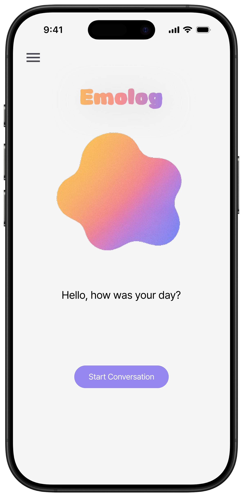
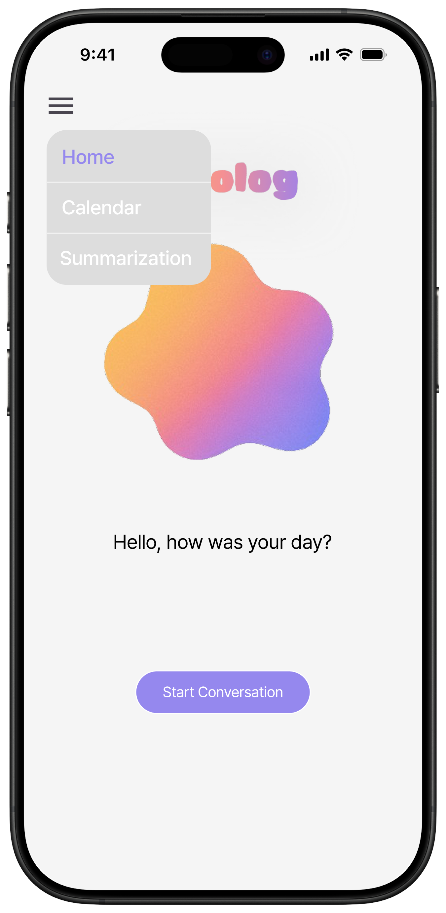
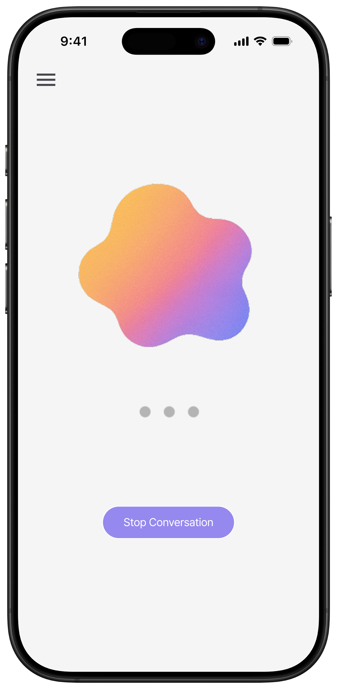
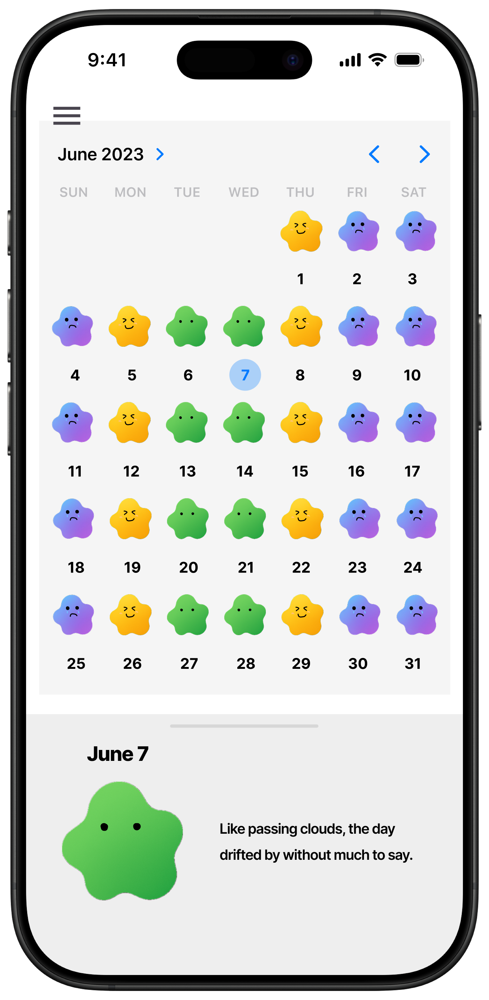
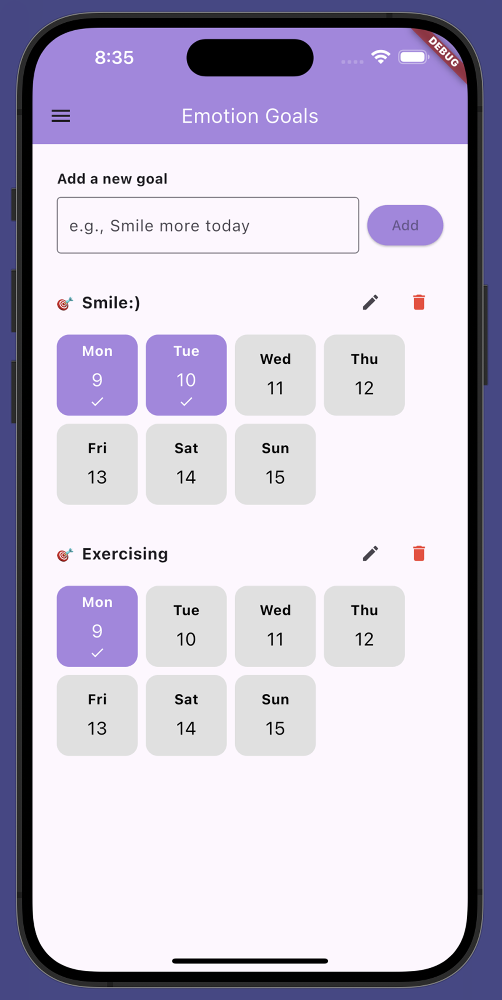
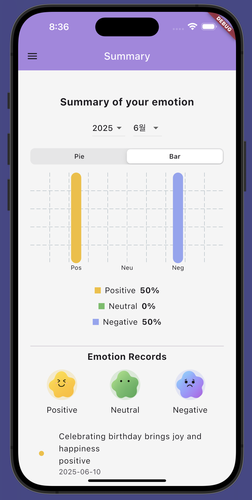
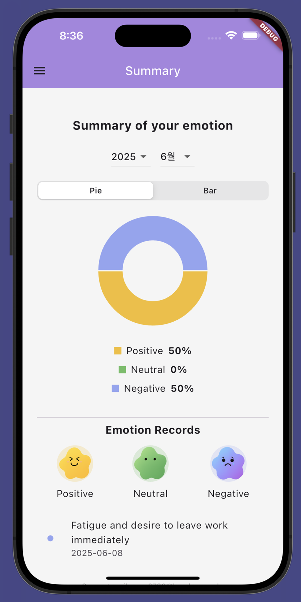
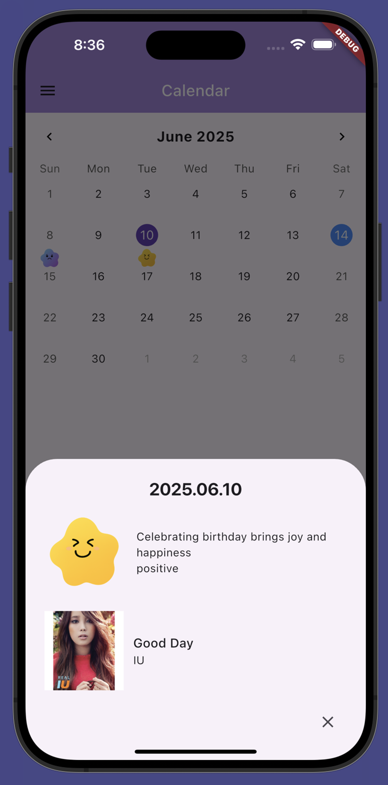

# Emolog: Emotional Support & Mood Tracking Service

<p align="center">
  
</p>

**Emolog**는 사용자의 감정 표현을 돕고 정신적 웰빙을 증진하기 위해 개발된 HCI(Human-Computer Interaction) 기반 서비스입니다. 대화형 AI와 멀티모달 감정 분석을 결합하여, 사용자가 자신의 기분을 기록하는 것을 넘어 감정의 원인을 성찰하고 조절할 수 있도록 돕습니다.

---

## 🌟 주요 기능 (Key Features)

### 1. 서비스 소개 및 온보딩

- 서비스의 목적과 사용 방법을 직관적으로 안내합니다. 

### 2. 멀티모달 감정 인식 및 대화

- **Text & Vision**: 텍스트 대화와 얼굴 표정을 동시에 분석하여 사용자의 상태를 정확히 파악합니다. 
- **AI Agent**: 공감 기반 인터랙션을 통해 사용자가 속마음을 털어놓을 수 있도록 가이드합니다.

### 3. 감정 캘린더 및 대시보드

- 일간, 월간 감정 패턴을 시각화하여 자신의 정서적 변화를 한눈에 트래킹할 수 있습니다.

### 4. 맞춤형 음악 큐레이션

- 감지된 감정 상태에 맞춰 심리적 안정을 돕거나 기분을 전환할 수 있는 음악을 추천합니다. 

---

## 💡 개발 배경 (Problem & Motivation)

현대 사회에서 많은 사람들은 감정적 피로를 느끼지만, 자신의 감정을 정확히 표현하거나 관리하는 데 어려움을 겪습니다. 
- **문제점**: 약 13%의 인구가 정신 건강 문제를 겪고 있으며, 기존 앱들은 수동적인 기록에 그칩니다.
- **해결책**: Emolog는 **"Low-effort, High-insight"**를 목표로, 기술이 사람의 감정을 이해하고 적절한 피드백을 주는 '따뜻한 HCI'를 구현했습니다.

---

## 🎨 Design System

- 사용자에게 편안함을 주는 컬러 팔레트와 일관된 UI 컴포넌트를 사용하여 심리적 안정감을 제공합니다. 

---

## 👥 팀원 소개 (Team 5)

본 프로젝트는 **25-2 Human Computer Interaction**의 팀5 프로젝트 결과물입니다.

- **Andy Park**
- **Ahyun Cho**
- **Heeseo Jeong**
- **Juhyang Kim**
- **Seoyoun Park**

---

## 🚀 시작하기 (Getting Started)

```bash
# 저장소 클론
git clone [https://github.com/seoyoon/emolog.git](https://github.com/seoyoon/emolog.git)

# 의존성 설치
pip install -r requirements.txt

# 실행
python main.py